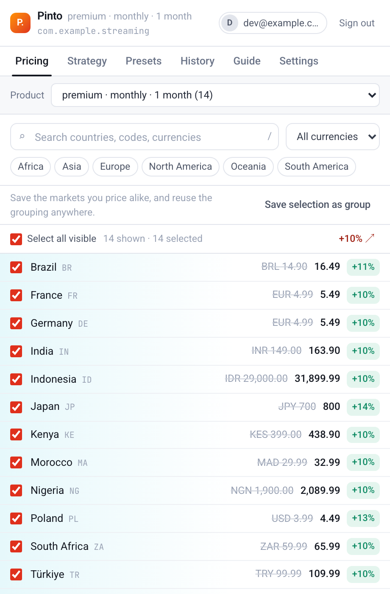
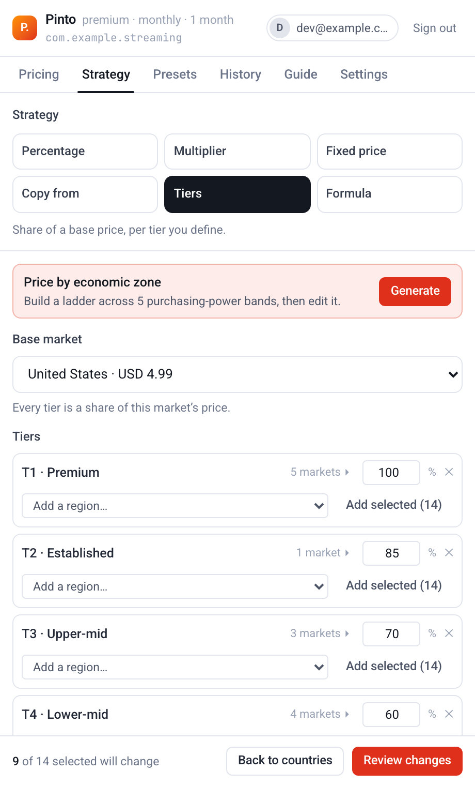
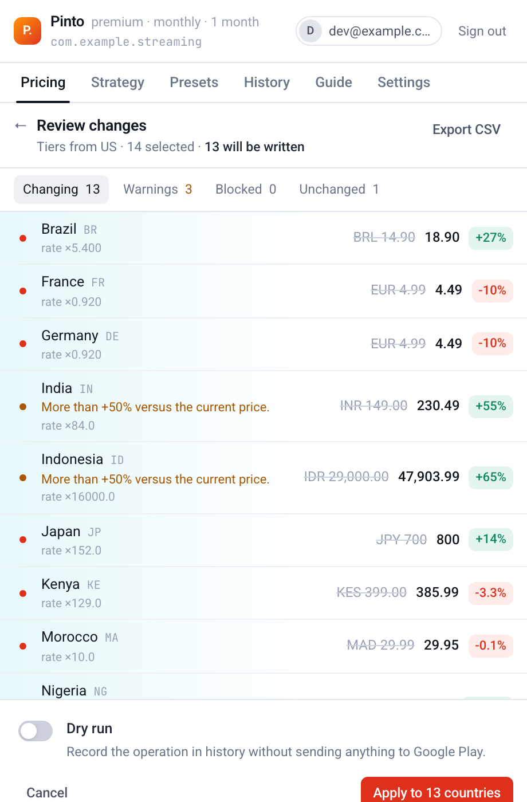
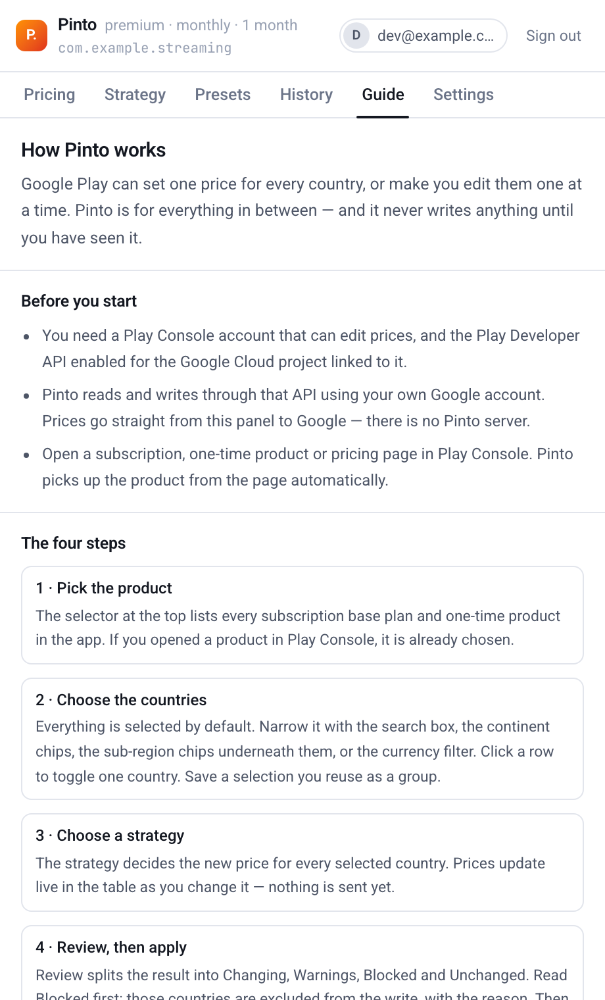

# Pinto

**Bulk pricing, without the bulk work.**

A Chrome extension for Android developers who need to change Google Play prices across many countries at once — with a review step before anything is written, and an honest report of what actually happened afterwards.

---

## What it does

Pinto lives inside Play Console. Open a subscription, one-time product or pricing page and a launcher appears; the panel opens next to the prices you were already looking at.

- **Select markets** by search, continent, sub-region, currency, or one at a time.
- **Apply a strategy** — percentage, multiplier, fixed price, copy-from-market, user-defined tiers, or a formula.
- **Price by economic zone in one click** — generate a purchasing-power ladder across five bands, pick how steep it is, and edit any share or country before applying.
- **Build a price ladder by hand** by dropping whole continents, sub-regions or your own saved groups into tiers you define.
- **Round** to charm endings, your own endings, whole units, or not at all.
- **Review every row** before applying: current price, new price, change, and any warning attached to it.
- **Apply**, then see what Google Play actually accepted — including which countries it rejected and why.
- **Undo**, using the price snapshot taken immediately before the write.
- **Learn it in the app** — a Guide tab walks through the workflow, the strategies, the safety rails and the common error messages, in English or French.

| | |
| --- | --- |
|  |  |
| **Pricing** — every market the product sells in, with the new price and the change beside the old one. Filter by search, continent, sub-region or currency. | **Tiers** — a purchasing-power ladder across five bands, generated on request and editable band by band and country by country. |
|  |  |
| **Review** — split into changing, warnings, blocked and unchanged. Blocked rows are never written, and every row says why. | **Guide** — the workflow, the strategies, the safety rails and the common error messages, in English or French. |

<sub>Screenshots are the real panel rendered against sample data by `npm run screenshots`, not mockups.</sub>

### How it talks to Google Play

Pinto reads and writes prices through the **Google Play Developer API** (`androidpublisher` v3), authenticated as you. It does not type into Play Console's UI and does not scrape prices out of the page.

That distinction is the whole design. DOM automation against Play Console is fast to build and breaks the week Google reshuffles a table — and when it breaks in a pricing tool, it breaks quietly and expensively. The API is a versioned contract; Pinto uses the page only to work out *which product you are looking at*.

| Capability | How it works | What happens when Play Console changes |
| --- | --- | --- |
| Reading prices | Play Developer API | Unaffected |
| Writing prices | Play Developer API | Unaffected |
| Detecting the page and product | URL parsing | Unaffected by visual redesigns; a route change is a one-line fix |
| Guessing the package name | Optional DOM read | Degrades to "type it once", which Pinto then remembers |
| Inline entry point next to the table | Optional DOM anchor | Falls back to the floating launcher |

Nothing in the price-writing path depends on scraping.

---

## Publishing

[`PUBLISHING.md`](PUBLISHING.md) covers the Chrome Web Store submission end to
end: the authentication decision that shapes the work, the developer
registration, the store listing, the per-permission justifications the form
demands, and the update flow. [`PRIVACY.md`](PRIVACY.md) is the policy the
submission links to.

```bash
npm run package
```

Builds and writes `release/pinto-<version>.zip`, ready to upload.

---

## Install and run locally

Requires Node 20+ and Chrome 114+.

```bash
npm install
```

```bash
npm run build
```

Then in Chrome:

1. Open `chrome://extensions`.
2. Turn on **Developer mode**.
3. Click **Load unpacked** and select the `dist/` directory.
4. Note the extension ID Chrome assigns — you need it for the OAuth setup below.

For iterative work:

```bash
npm run dev
```

That rebuilds on change. Reload the extension in `chrome://extensions` to pick up service-worker and content-script changes; the panel picks up UI changes on reopen.

---

## Authentication setup

Pinto ships **without** an OAuth client ID. You create one in your own Google Cloud project, which means the Play Developer API access is granted to your client and revocable by you — no third-party app sits between you and your pricing.

1. In [Google Cloud Console](https://console.cloud.google.com/), select (or create) the project that is **linked to your Play Console developer account** (Play Console → Setup → API access).
2. Enable the **Google Play Android Developer API** for that project.
3. Configure the OAuth consent screen. "Internal" is fine for a Workspace org; "External" in testing mode works too — add yourself as a test user.
4. Create an OAuth client ID of type **Web application**.
5. Add this authorised redirect URI, replacing the id with your unpacked extension's:

   ```
   https://<your-extension-id>.chromiumapp.org/
   ```

   Pinto shows the exact URI with a copy button on its sign-in screen — use that rather than typing it.
6. Copy the client ID into Pinto's sign-in screen and click **Continue with Google**.

You also need a Play Console account with permission to edit prices for the app in question.

### How the token is handled

Pinto uses `chrome.identity.launchWebAuthFlow` with the **implicit** flow. The authorization-code flow for a web client requires a client secret, and a secret shipped inside an extension is not a secret — so Pinto takes the option that never involves one.

The consequence is a good one: Pinto only ever receives a short-lived access token. There is **no refresh token**, and the access token is stored in `chrome.storage.session`, which is memory-only and cleared when Chrome closes. When the token expires, Pinto silently mints a new one from your existing Google session with no interruption.

Scopes requested:

| Scope | Why |
| --- | --- |
| `https://www.googleapis.com/auth/androidpublisher` | Read and update product prices |
| `openid`, `email`, `profile` | Show which account is connected |

---

## Permissions

| Permission | Why it is needed |
| --- | --- |
| `storage` | Presets, history with price snapshots, settings, and the app-id → package-name map, all local |
| `identity` | The Google sign-in flow |
| `https://play.google.com/console/*` | Inject the launcher and read the current route |
| `https://androidpublisher.googleapis.com/*` | The Play Developer API |
| `https://openidconnect.googleapis.com/*` | Fetch your name, email and avatar after sign-in |

There is no `tabs` permission: Pinto reads the current tab's URL through its host permission, which limits it to Play Console pages. There is no broad `<all_urls>` host permission and no remote code.

---

## Supported Play Console pages

Pinto activates on `https://play.google.com/console/*` when the route is a monetisation page:

- Subscriptions — list and detail, including a specific base plan
- One-time products (`managed-products`, `one-time-products`, `in-app-products`)
- App pricing

Play has two generations of one-time product and Pinto reads both: the newer
purchase-option model (`monetization.onetimeproducts`) and the legacy managed
products (`inappproducts`). An app migrated to the newer model has its legacy
collection refused outright by Google, which Pinto treats as expected rather
than reporting it as a fault. Google's own reference pages disagree on the URL
casing for that resource and the live API has disagreed with both, so the read
and write paths are each probed once and cached separately.

It reads the developer id, the internal app id, and — when present — the product id and base plan id from the URL, then opens that product automatically.

Play Console's URL carries an internal numeric app id, not a package name, and the API is keyed by package name. Pinto tries to read the package name from the page once; if it can't, it asks you, and remembers the answer for that app.

---

## Architecture

```
src/
  domain/          pure business logic — no React, no Chrome, no network
    money/         micros arithmetic, currency decimals, formatting
    pricing/       rounding, conversion, change-set computation, validation
    regions/       country table, economic bands, groups, filtering
    formula/       hand-written expression parser (no eval)
    presets/       zod schemas for untrusted preset imports
  services/        API client, auth, storage, logging, message contract
  background/      MV3 service worker: routing and the apply engine
  content/         page detection, launcher injection, panel window chrome
  panel/ popup/    entry points
  app/             shell, store, theme, i18n dictionaries
  components/      design system primitives
  features/        auth, pricing, strategies, regions, presets, history,
                   guide, settings
```

**The rule that shapes everything:** pricing logic is pure and lives in `domain/`. `computeChangeSet` takes a product, a selection and a strategy and returns the exact rows that will be written. The review screen renders that value; the apply engine sends that value. There is no second code path where the numbers could diverge from what you approved.

### Responsibilities

**Content script** (`src/content/`) — detects the route, injects the launcher and the panel iframe, sniffs the package name on request. No pricing logic, no API calls, no React. All of Pinto's UI renders inside a shadow root or an extension-origin iframe, so Play Console's stylesheets can't reach it and Pinto's can't leak out.

**Service worker** (`src/background/`) — owns authentication, the API client, the apply engine and all persistence. It survives the panel closing and the tab navigating. Every cross-context call goes through one discriminated union in `src/services/messages.ts`.

**Panel** (`src/panel/`, `src/app/`, `src/features/`) — a view over the worker's state. It never touches `chrome.runtime` directly; the typed `send()` client does.

### Pricing by economic zone

This is the reason the extension exists. Play Console can set one price for every country, or make you edit them one at a time; it has no concept of "charge less where people earn less". Pinto generates that ladder.

`src/domain/regions/economicBands.ts` groups every supported country into five purchasing-power bands, and `generateLadder()` turns a band table plus a steepness curve into a tier strategy. The basis is stated in the file and in the UI: World Bank income groups and GNI per capita at PPP, adjusted for observed app-store spend — a defensible starting point, not a measurement, and one that ages.

Shipping that table is a judgement, so it comes with hard constraints rather than a disclaimer:

- **Never automatic.** The user picks Tiers, sees the bands, and can regenerate at a different steepness or start from `Flat` — the same price everywhere — and open the gaps by hand.
- **Never opaque.** Every band shows its share, its country count and, on click, the full list. The resulting price per band is previewed before generating.
- **Never final.** Shares are editable numbers; countries can be moved between bands or removed entirely; and nothing reaches Google without passing through Review.

The generated presets in `presets/` are built from the same module, so what ships and what the extension produces cannot drift apart.

### Two decisions worth explaining

**Currency conversion that survives being run twice.** "Set European markets to €4.99 equivalent" needs exchange rates, and no third-party rates service is involved — that would mean sending pricing context elsewhere and producing numbers that disagree with Google's own conversion.

Pinto asks Google instead, through `convertRegionPrices`: the same conversion Play Console performs, for a reference amount, independent of the product's current prices. That independence is the point. Deriving rates from the product's own prices — the obvious approach, and Pinto's first one — works exactly once: after a ladder tiers the markets, re-deriving rates from those tiered prices compounds the tiering, and applying the same preset twice collapses the low bands. Sourcing the table from Google makes the operation idempotent, which a test asserts by feeding a result back in and expecting no change.

Rates implied by the product's own prices remain the fallback when the conversion call fails, so a network hiccup degrades the result instead of blocking the write.

**Partial failure, when the API is all-or-nothing.** Play has no per-country price endpoint: one call writes the whole product, and one bad country fails the batch with an error that may not name it. Pinto attempts the change atomically, and on rejection **binary-searches** the change set to find the exact countries responsible, applying everything that works. Then it re-reads the product to confirm what actually landed. "Updated 128 of 132 countries, here are the 4" is a measured result, not an assumption.

---

## Testing

```bash
npm test
```

```bash
npm run typecheck
```

295 tests across three levels:

- **Unit** — micros/`Money` round-trips and currency granularity, rounding (including the invariants that it never moves a price by more than one unit and never lands on a round `.00`), the formula parser and its sandbox, conversion tables, the economic bands and ladder generator, region filtering, preset and translation-dictionary validation.
- **Integration** — `computeChangeSet` across every strategy; the full panel state machine from boot through selection, strategy, review and apply, asserting that what the review screen showed is exactly what gets sent; the apply engine's bisect isolation, dry run, undo and unrecoverable-error paths against a fake Play that behaves like the real all-or-nothing endpoint.
- **Extension** — content-script injection and shadow-root isolation, inline-anchor detection and its fallback, package-name sniffing, URL-based page detection, message-passing failure modes, React rendering of the sign-out / unsupported-page / unknown-app / pricing / review screens, and the full tiering flow driven through the UI.

Chrome APIs are faked in `tests/chromeMock.ts` with real backing stores, so a test can assert that a token never lands in `storage.local`.

---

## What Pinto stores

**On this machine** (`chrome.storage.local`): your OAuth client ID, presets, the last 50 operations with their price snapshots, the app-id → package-name map, and a technical log. The log records region codes, product ids and API status codes — not prices.

**In memory for the browser session** (`chrome.storage.session`): the access token and your name, email and avatar.

**Nowhere else.** Pinto has no backend. Prices go from the panel to `androidpublisher.googleapis.com` and nowhere in between. Settings → *What Pinto stores* says the same thing inside the product.

---

## Known limitations

- **Countries must already exist on the product.** Play's API updates prices for regions the product already offers; it does not add a country. Add the market in Play Console first, then price it here. Pinto refuses such a write with a clear message rather than sending something that will fail.
- **Existing subscribers keep their price.** New prices apply to new subscribers. Changing what existing subscribers pay is a separate Play flow with its own notice and consent rules, and Pinto deliberately does not automate it. The review screen says so.
- **Conversion needs a currency Google will quote.** A market Google's conversion does not return, and that the product does not already price, has no rate; those rows are blocked with an explanation instead of guessed.
- **Offers and prepaid plans are not edited.** Pinto writes base-plan and one-time-product prices. Offer prices are passed through untouched.
- **One product at a time.** Applying one strategy across several products in one action is not implemented; the architecture allows it (the apply engine is keyed per product) but the UI is single-product.
- **The package-name sniff is best-effort.** It is the one place Pinto reads Play Console's DOM. When it fails you type the name once.
- **The regions version is discovered, not pinned.** Play requires one on every write and validates every region's currency against it, but exposes no way to read the current value — and the published default predates changes such as Bulgaria adopting the euro, which makes it reject valid prices. Pinto learns the live version from `convertRegionPrices` and falls back to the configured default only if that call fails.
- **Rate limits.** Large or repeated operations can hit Play Developer API quotas; Pinto reports a 429 as retryable rather than retrying in a loop.

---

## Keyboard

| Key | Action |
| --- | --- |
| `⇧P` | Open or close Pinto from Play Console |
| `/` | Focus the country search |
| `⌘/Ctrl + A` | Select or clear all visible countries |
| `⌘/Ctrl + ↵` | Review changes |
| `Esc` | Close the panel |

The panel is a window, not a fixed sidebar: drag its title bar to move it, dock
it to either edge with the arrow buttons, drag an edge or corner to resize, and
collapse it to its title bar with `▾` or a double-click on the bar — enough to
reach whatever is underneath without closing Pinto. The layout is remembered.

---

## Stack

TypeScript · React 19 · Vite 6 · Tailwind 4 · Zustand · Zod · Vitest. No UI framework beyond the design system in `src/components/`, no HTTP client, no date library, no state-machine library.

Two Vite configs: the panel, popup and service worker build as ES modules; the content script builds as a single IIFE, because MV3 content scripts cannot be modules.
